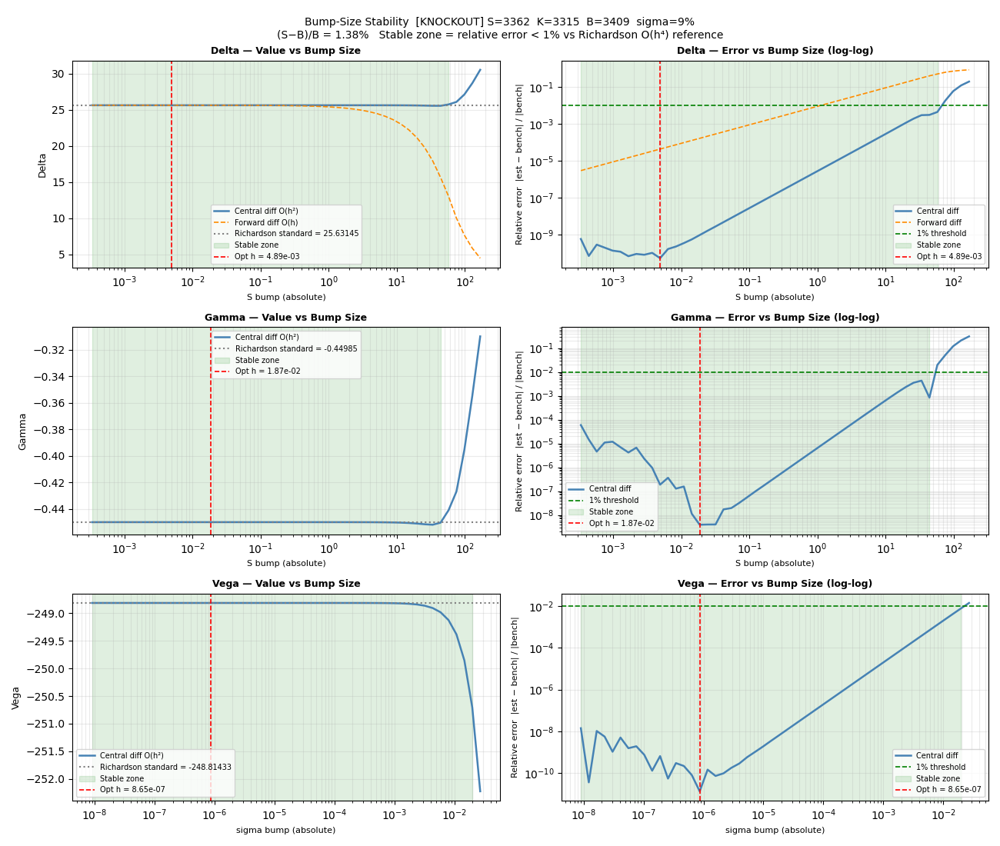
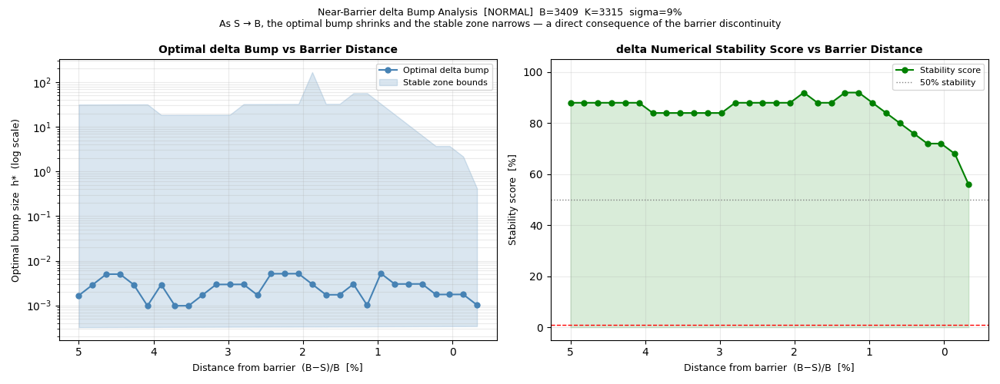
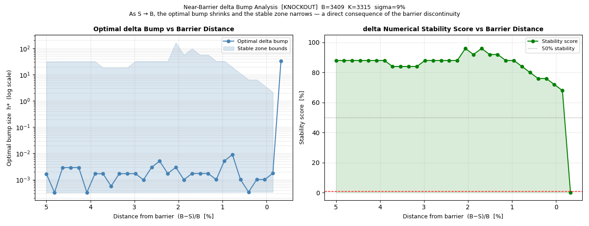
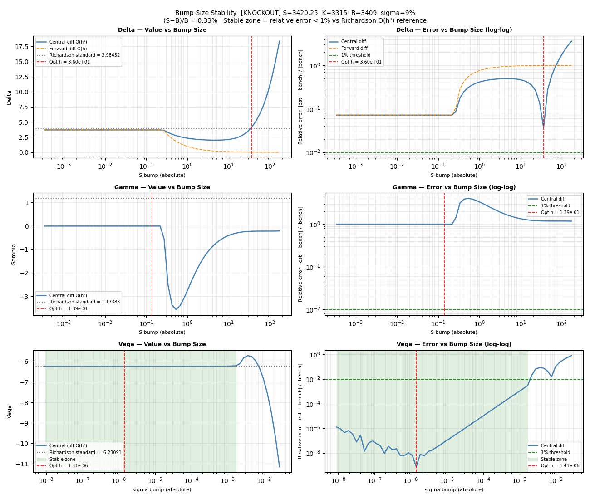
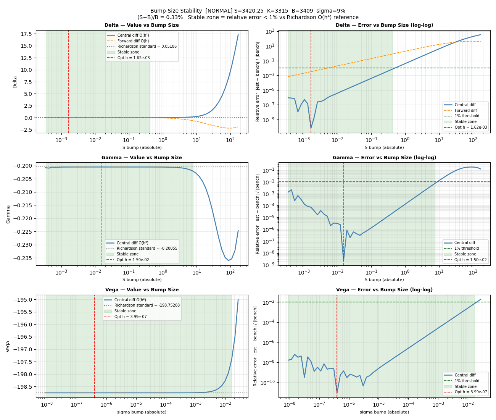

# Bump-Size Stability of Finite-Difference Greeks

How the choice of bump size h affects the accuracy of finite-difference
Greeks, and why the knock-out barrier makes numerical differentiation break
down entirely in a narrow band around B.

---

## Purpose

The knock-out accumulator computes its Greeks by finite difference. The
accuracy of a finite-difference derivative depends on the bump size h, limited
by two errors pulling in opposite directions:

- **Truncation error** — the Taylor remainder, O(h²) for central difference,
  grows as h increases.
- **Round-off error** — floating-point cancellation in `V(S+h) − V(S−h)`,
  grows as h shrinks.

There is an optimal h balancing the two. This module scans h across many
orders of magnitude, benchmarks each estimate against a Richardson-
extrapolated O(h⁴) reference, and identifies the **stable zone** where the
relative error stays below 1%.

Note on the barrier level: when evaluating the knock-out pricer, the model's
effective barrier is the **BGK-adjusted B_adj = 3420.51**, not the barrier
B = 3409 of contract. So the stress tests below position spot relative to B_adj.
---

## 1. Baseline: far from the barrier

At S = 3362, with spot 1.38% below the barrier, every Greek shows the
textbook U-shaped error curve (right column, log-log):

- Large h → truncation error dominates (right side rises)
- Small h → round-off error dominates (left side rises)
- A wide minimum in between → the stable zone (green band)

The optimal bumps are well-behaved: ~5e-3 for delta, ~2e-2 for gamma, ~9e-7
for vega. (Vega's optimal h is far smaller because vega bumps $\sigma$, an O    (0.1)
quantity, not S, an O(3000) quantity.) Forward difference (orange, delta panel)
is visibly worse than central — its error floor is O(h) rather than O(h²).

This is the comfortable spot: pick any h in the wide green band and the Greek
is reliable.

---

## 2. Approaching the barrier: the stable zone narrows

Sweeping spot from 5% below the barrier toward B_adj, and tracking delta's optimal
bump and stability score:

- **Far out (5%–2% from barrier):** stability score sits around 85–90% — most
  bump sizes work.
- **Close (<1%):** the score deteriorates. For the **normal** accumulator
  it falls to ~56% at the B_adj; for the **knock-out** it collapses to ~0%.

The optimal bump h* also shrinks and becomes erratic as S → B_adj: the usable
window is being squeezed from above (bumps can no longer be large) while the
round-off floor stays fixed below.

---

## 3. At the barrier: normal survives, knock-out fails

This is the central result. Both products are placed at S = 3420.25, just
0.26 points below B_adj = 3420.51.

### Knock-out: no stable zone exists

For the knock-out, **delta and gamma have no stable zone at all** — the entire
error curve sits above the 1% threshold. There is no bump size that gives a
reliable delta or gamma.

The reason is the barrier discontinuity. With spot only 0.26 points from
B_adj, the central difference `(V(S+h) − V(S−h)) / 2h` faces an impossible
choice:

- If **h > 0.26**, the upper point S+h crosses B_adj. The model knocks out 
  and the value jumps to the rebate. V(S+h) is a knocked-out
  value while V(S−h) is still alive — the two are in different regimes and
  their difference is meaningless.
- If **h < 0.26**, the bump stays on the alive side, but it is now so small
  that round-off error is large.

No h satisfies both "doesn't cross the barrier" and "large enough to beat
round-off." The stable zone has been squeezed out of existence. (Only vega
retains a stable zone, because it bumps $\sigma$ and never crosses the spot barrier.)

For reference, at S = 3420 — just 0.25 points further from the barrier — a
narrow stable zone still exists. Theis 0.25 point is the difference
between a usable Greek and an unusable one.

### Normal: the stable zone narrows but survives

At the same spot S = 3420.25, the **normal** accumulator still has a stable
zone (the green band remains). Why does the no-knock-out product survive where
the knock-out fails?

- The normal accumulator's value is a discounted sum of vanilla prices.
  Vanilla prices are smooth in any spot, smoothing away the payoff's kinks. 
  So V(S) is everywhere smooth; near the barrier it
  merely has **high curvature** (large gamma), which inflates truncation error
  and narrows the stable zone from above. But because V(S) is continuous, a
  small enough bump still approximates the derivative meaningfully.

- The knock-out's value, by contrast, has a character of discontinuity in V(S) at
  the model barrier B_adj. This comes from the pricing logic itself, whereas just below B_adj 
  it is priced by the Haug barrier formula. And returns to rebate after crossing B_adj. 
  A central difference straddling B_adj therefore takes
  one point from the alive (Haug) regime and one from the dead (rebate-constant)
  regime. Their difference is not an approximation of any derivative.

The normal accumulator's value is smooth everywhere (just steep near B), so its Greeks get
harder but remain computable. The knock-out's value jumps at B_adj, so within a
bump's reach of the barrier the finite difference fails.

---

## What to do when no bump size works

When spot is within ~0.3% of the barrier and finite-difference Greeks become
unreliable (or impossible), the options are:

1. **One-sided difference toward the alive side.** Bump only away from the
   barrier, avoiding the discontinuity. Accuracy drops to O(h) and is still
   round-off-limited, but it produces a usable (if biased) number.

2. **Analytic / semi-analytic Greeks.** The Haug barrier formula is closed-
   form and can be differentiated analytically, sidestepping bumps entirely.
   This is the right approach near the barrier, where numerical differentiation
   is hopeless.

3. **Repricing and Manual intervention.** Rather than hedging with a
   single delta, reprice the position at several discrete spot scenarios. This
   is exactly the "manual desk intervention" regime described in the
   [pin-risk analysis](pin_risk_comparison.md) — and it is no coincidence that
   the spot region where Greeks are numerically unreliable is the same region
   where pin risk is most severe.

The practical conclusion: **near the barrier, abandon finite-difference Greeks
in favour of analytic derivatives or scenario repricing.** The numerical
breakdown documented here is the quantitative counterpart of the pin risk seen
in the Greek profiles.

