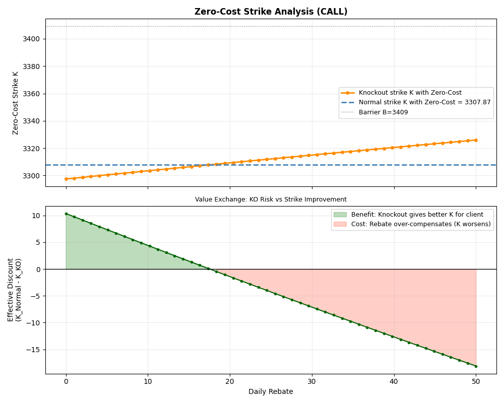
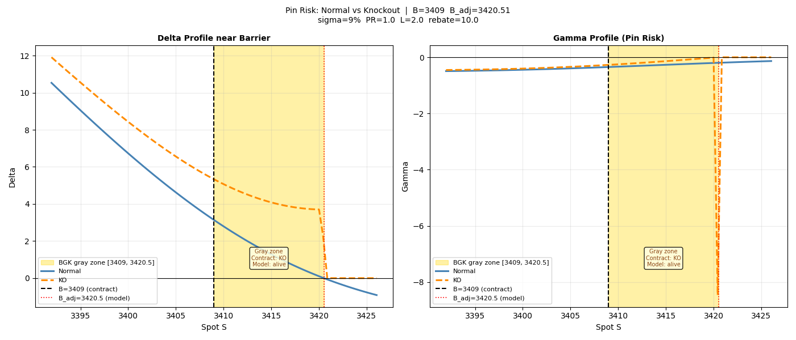
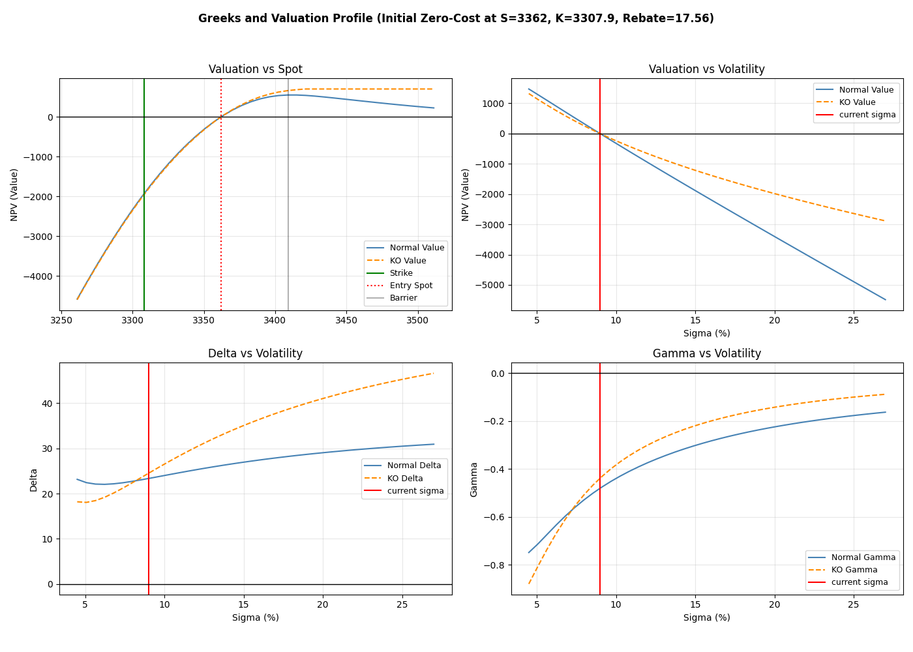

# Normal-vs-KO Comparison & Pin Risk 

How the knock-out feature reshapes the accumulator's risk profile, focusing on
the structuring trade-off, the barrier pin risk, and Greeks and Valuation sensitivity.

---

## Purpose

A knock-out accumulator is a normal accumulator plus a barrier that terminates
the contract on first touch (paying a rebate). This module compares the two
products from three angles a structurer and a risk manager would care about:

1. **Structuring trade-off** — how much better a strike can a client get by
   accepting knock-out risk?
2. **Pin risk** — what happens to Delta and Gamma when the spot is close to 
   barrier, and what is "gray zone"?
3. **Greeks and Valuation sensitivity** — how do value and Greeks behave as spot and vol
   move?

### Test scenario

| Parameter                       | Value                         |
|---------------------------------|-------------------------------|
| Spot S                          | 3362                          |
| Barrier B                       | 3409                          |
| Volatility                      | 9%                            |
| Participation PR                | 1.0                           |
| Leverage L                      | 2.0                           |
| Rebate (KO)                     | 10.0                          |

---

## 1. Zero-Cost Strike Trade-Off

A common way to sell these products is "zero-cost": the strike (and, for the
KO, the rebate) is set so the contract has zero value at initial time. The question for
the client is whether accepting knock-out risk buys a better strike.

The top panel shows the zero-cost strike of the knock-out product as the
rebate varies, against the normal product's fixed zero-cost strike (3307.87).
The bottom panel shows the effective strike improvement for the client.

When rebate is low, investors take a greater risk of loss from knocking out, 
thus can gain a better strike. As rebate increase, the strike become increasingly worse.

---

## 2. Pin Risk Near the Barrier

This is the most important risk diagnostic for the knock-out product. The plot
zooms into a ±0.5% window around the barrier B=3409 and shows Delta (left) and
Gamma (right) for both products.

### The BGK gray zone

The shaded band runs from the contractual barrier B=3409 to the
model-adjusted barrier B_adj=3420.51 — a width of 11.5 points, or 0.338% of B.
The adjustment comes from the BGK discrete-monitoring correction (the model
shifts the effective barrier outward because daily monitoring is less likely to
touch than continuous monitoring; 

**Inside this band, contract and model disagree:**
- By the *contract*, spot has passed B=3409, so the option has knocked out.
- By the *model*, spot has not yet reached B_adj=3420.51, so the option is
  still priced as alive.

This is an operational hazard, not just a numerical one. A desk relying on the
model's Greeks would keep hedging a position that, contractually, no longer
exists. In practice this band is flagged for manual desk intervention rather
than automated hedging.

### The pin: Delta discontinuity and Gamma spike

- **Delta (left panel):** the KO's delta (orange dashed) drops sharply — from
  about 3.7 to near zero — at the right edge of the gray zone. This is the
  knock-out "switching off" the position's spot exposure. The normal product's
  delta (blue) declines smoothly through the band.

- **Gamma (right panel):** the KO's gamma plunges to a sharp negative spike
  (around -8) at B_adj, the mark of **pin risk**. Gamma is the rate of
  change of delta; the near-discontinuous delta drop represents an extreme,
  localized gamma. The normal product's gamma stays mild and smooth.

A large localized gamma means the hedge ratio changes violently for a tiny spot
move near the barrier. Delta-hedging through this region is both expensive
(rapid rebalancing) and unstable (the hedge can flip), which is why barrier
products near the barrier are difficult to manage and why this  region is handed 
to manual oversight.

(See [`analysis/bump_size.py`](../../analysis/bump_size.py) for how the
finite-difference Greeks themselves become numerically unstable in exactly this
region.)

---

## 3. Greeks and Valuation Sensitivity

After setting the contract to zero-cost (solving for both strike K=3307.87 and
rebate=17.56), this panel sweeps spot and volatility to compare how the two
products behaving.

### Value vs Spot (top-left)

When prices are low enough, the values of the two products are almost identical. 
However, as prices approach or exceed the barrier price, the value of the **KO** stabilizes 
at the knock-out payout, while the value of the **Normal** decreases after reaching its peak. 
This is because at this point, exceeding the **B** results in zero payout daily, but the 
contract still alive, thus higher prices cause the option value to decline.

### Value vs Volatility (top-right)

Both products lose value as vol rises — both are **short vega**, This is because, 
as volatility increases, if prices fall, the leverage downside can blow the losses. 
If prices rise, the option will either terminate or not pay out daily. 
The reason that the value of **KO** decreases more slowly than **Normal** is knocking out 
can generate rebate, which to some extent compensates for the value loss.

### Delta vs Volatility (bottom-left)

The KO's delta rises noticeably with vol, while the normal's is flatter. Higher
vol raises the probability of reaching the barrier, increasing the KO's
sensitivity to spot, this reflects the cross-influence of price and volatility.
(the same effect that makes the KO's Vanna larger in the PnL analysis).

### Gamma vs Volatility (bottom-right)

Both gammas are negative (short convexity). At low vol the KO's gamma is more
negative than the normal's — low vol concentrates the knock-out probability
near the barrier, sharpening the gamma. Meanwhile, high vol smooths the discontinuity,
the options are less sensitive to whether they are knocked out.
This is a useful warning: **the knock-out's gamma instability is worst in
low-volatility regimes**, precisely when desks might otherwise expect calm
hedging.

