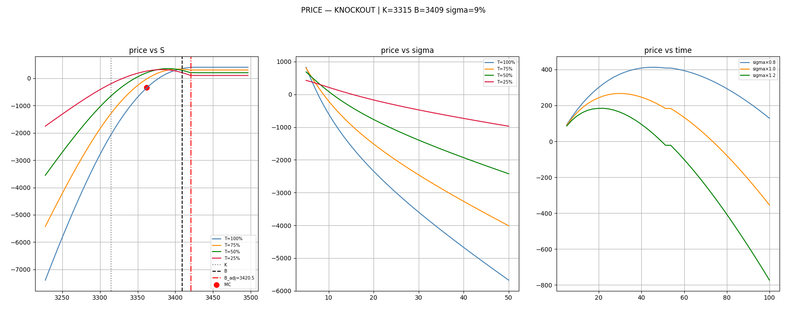
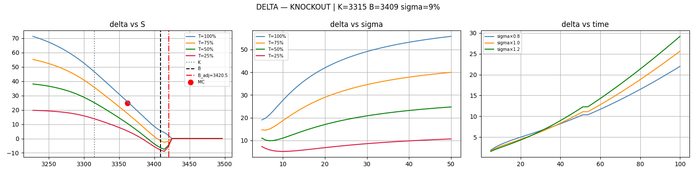
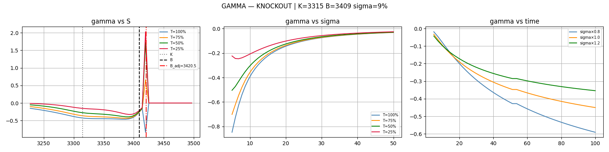
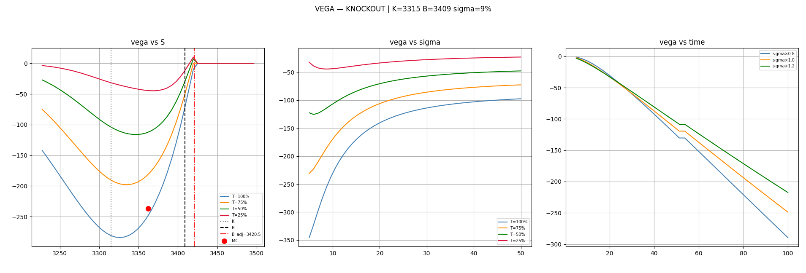
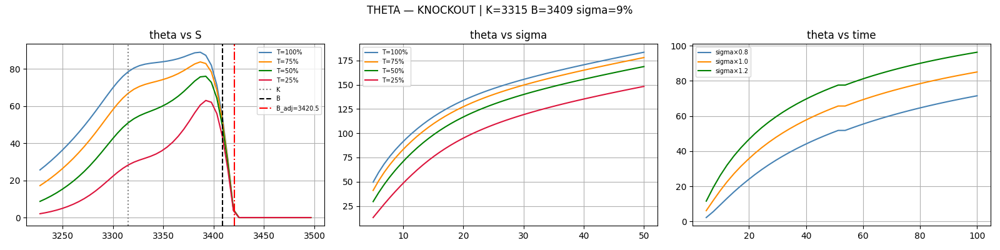

# Greeks Analysis — Knock-Out Accumulator

How the knock-out accumulator's price and Greeks behave across spot,
volatility, and time-to-maturity, with particular attention to the sign
flips that appear near the barrier.

---

## Purpose

This module shows the full Greek surface of the knock-out accumulator. Only the
knock-out is plotted — its barrier produces a far richer Greek structure than
the normal accumulator.

Each metric is shown in three panels: spot, volatility,and time-to-maturity. 
The spot panel marks the strike K, the contractual barrier B, and
the BGK-adjusted model barrier B_adj.

Base scenario: S=3362, K=3315, B=3409, σ=9%, PR=1, L=2, rebate=10, call.
B_adj = 3420.5.

---

## The one idea everything follows from: stay alive vs knock out

Near the barrier there are two circumstances:
- **Stay alive:** collect each remaining day's payoff, (S-K) per day.
  But over time spot may fall back toward K, earn less, or turn into a leveraged loss.
- **Knock out:** receive rebate × remaining days, and stop.

Which is worth more depends on **how much time is left**, because time controls
how much spot can move:

- **Short maturity:** little time for spot to fall, so staying alive almost
  certainly keeps (S-K) per day — far more than the small rebate in most cases. The option
  **fears knock-out**, and that fear caps the value early. **The price peak sits
  far to the left.**
- **Long maturity:** lots of time for spot to fall back, so
  the "stay alive" value is heavily discounted; meanwhile rebate × many days is
  larger. The two are close, so knock-out is **not feared** — the value rises
  almost to the barrier. **The peak sits near the barrier**, and the value
  barely drops at knock-out.

Side check: with more time, spot has more chances to fall below K into leveraged
losses, so a higher spot is needed to break even — the zero crossing also sits
furthest right for long maturities, as the price panel shows.

## 1. Price

**vs Spot.** Discussed in the above chapter.

**vs Volatility.** Value falls as vol rises (short vega) for longer maturities,
the leveraged-downside effect dominating. The decline is steeper for T=100%
than for T=25%.

**vs Time.** More time first means more days to collect payoff (value up), 
but eventually means more accumulated knock-out and fall-back risk (value down), 
with a peak in between. Lower volatility pushes that peak
to a longer maturity — with spot moving less, knock-out and fall-back risk
build up more slowly, so the position can be held safely for longer.

---

## 2. Delta

Delta is simply the **slope of the price curve**: if spot rises a little, does
the value go up (delta > 0) or down (delta < 0)?

On the price hump:
- left of the peak, the value is still rising → **delta > 0**
- at the peak → **delta = 0**
- right of the peak, the value is falling → **delta < 0**

Now combine with where the peak sits:
- **T=100%:** the peak is near the barrier, so when spot is just below the
  barrier it is still on the **left** of the peak → value still rising →
  **delta is positive**.
- **T=25% / T=50% / T=75%:** the peak is further left, so by the time spot reaches the
  barrier it is already **past** the peak → value falling → **delta is
  negative**.

  
For short maturities, delta dips to its most negative between B and B_adj, then **quickly back to zero** approaching B_adj.
Because the value of the option changes from a continuously decreasing value to a constant value.
This rapid recovery of delta is what produces the gamma spike below.
Above B_adj delta is zero — the contract is dead. 

The MC overlay (red dot) sits on the analytic curve, validating the analytic
delta.

---

## 3. Gamma

Gamma is the **rate of change of delta** — equivalently, how the price curve
bends:

- where the price curve bends downward (a hilltop shape), delta is decreasing →
  **gamma < 0**
- where it bends upward (a valley, or where a fall flattens), delta is
  increasing → **gamma > 0**

At almost all points, since delta is constantly decreasing, gamma is always negative.
When **T=25%/T=50%/T=75%** where the spot is close to B_adj, since delta rises from negative to 0,
gamma is positive.

**The spike at B_adj:** as delta snaps from very negative or positive back to zero across a
tiny spot range, gamma — its derivative — explodes. This is the numerical face
of **pin risk**. Gamma's
magnitude shrinks as vol rises, since higher vol smooths the barrier.(See
[pin-risk analysis](../docs/Comparison_and_pin_risk.md) for the same effect.)

**No MC overlay.** Monte Carlo gamma via a second difference is unreliable at
these path counts — the second difference amplifies MC noise by 1/eps^2,
swamping the signal. The analytic gamma is validated indirectly through the
price and delta overlays.

---

## 4. Vega

**vs Spot — another maturity-dependent sign flip.** Vega measures sensitivity
to volatility:

- **T=100%:** vega is **negative** near the barrier — with long time left, the
  dominant effect of volatility is a greater chance of an early knock-out with little rebate.
- **T=25% / 50%:** vega turns **positive** — close to expiry, volatility could cause 
   spot changes from barrier level to the under barrier level which can generate the high-profit.
- **T=75%:** the two effects roughly cancel, and vega is near **zero**.

In general, when the price is far from the barrier level, the position is penalized 
by vega (potentially the price falling below the strike price, resulting in 
leveraged losses or position knockout risk). However, when the price is near the 
barrier level and the expiration date is short, volatility may cause the price to fall 
back below the barrier level, thereby yielding higher payouts.

**vs Volatility / Time.** Vega is negative and mean-reverting in vol; over time
it decays as the option's optionality is consumed.

---

## 5. Theta

**vs Spot.** Theta (per trading day) is large and positive over most of the
spot range — for the client (long), time passing without a large adverse move
is beneficial, since each surviving day accrues payoff. Near and above B_adj
theta collapses to zero: once knocked out, no further time value accrues.

**vs Volatility / Time.** Theta grows with vol and with time-to-maturity,
consistent with more optionality being decayed.

**No MC overlay.** Theta via differencing two separate simulations on shifted
observation schedules is unreliable here — the two simulations are not directly
comparable and the small theta is a difference of two large numbers. The
analytic theta is not validated by an MC theta point.

---

## A note on Monte Carlo validation

The MC overlay is shown only for **price / delta and vega**, where it agrees with the
analytic curves and provides genuine validation. For **gamma and theta**,
simple Monte Carlo differencing is unreliable at 30k paths — second-order spot
differences and time-shift differences amplify MC noise far beyond the signal.
Rather than display misleading overlay points, these are omitted.

