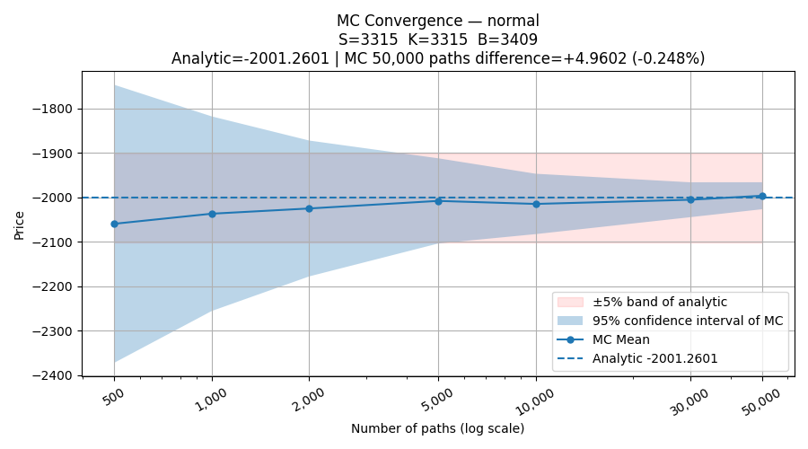
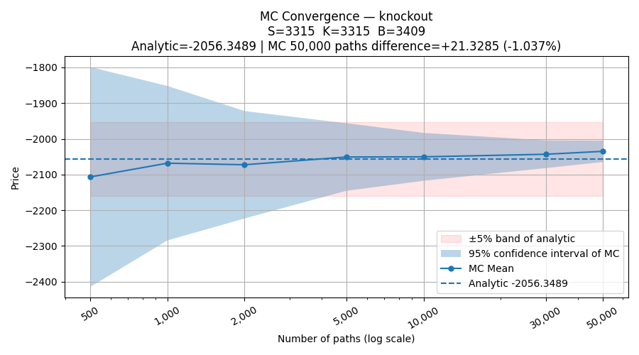
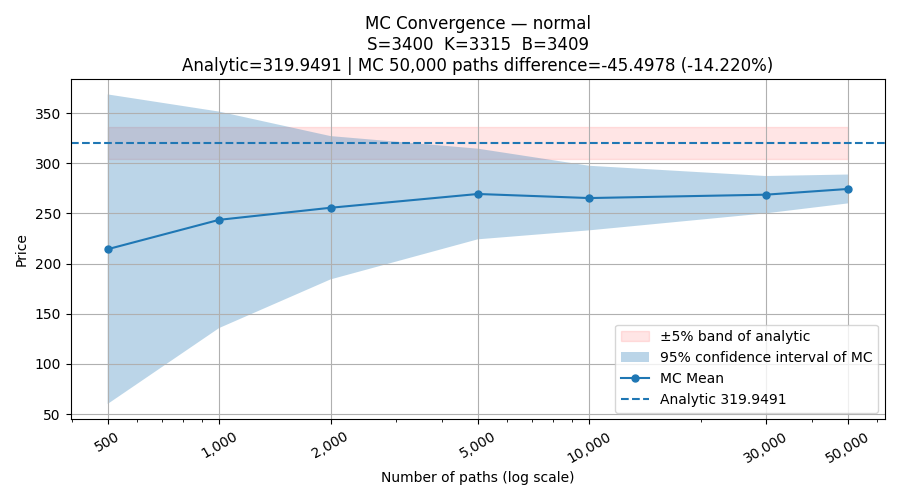
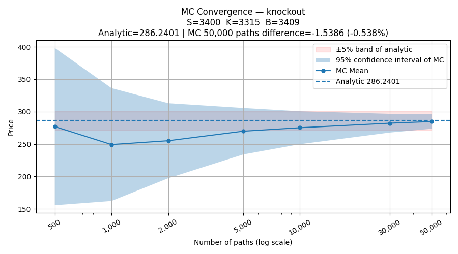

# Monte Carlo Convergence

Validating the analytic pricers against Monte Carlo, and what the
barrier-region discrepancy reveals about each method's domain of validity.

---

## Purpose

The analytic prices — Carr-Madan static replication for the **Normal** accumulator,
Haug closed-form for the **Knockout** — should agree with a Monte Carlo simulation
of the same contract. This module plots the MC mean and its 95% confidence
interval against the analytic price as the path count grows, with a ±5%
reference band around the analytic value.

A correct implementation shows the MC mean settling into the analytic value,
with the confidence interval shrinking as $1/\sqrt{n}$ and covering the analytic price
at large n.

---

## Result: convergence depends on where spot sits

Two spot positions are tested: at the strike (S = K = 3315) and near the
barrier (S = 3400, with B = 3409).

| Scenario           | Analytic | MC (50k) difference |
|--------------------|----------|---------------------|
| Normal, S = K      | -2001.26 | -0.25%              |
| Knockout, S = K    | -2056.35 | -1.04%              |
| Normal, S near B   | 319.95   | **-14.22%**         |
| Knockout, S near B | 286.24   | -0.54%              |

### At the strike: both converge cleanly




At the strike, both products converge well — the MC mean tracks the analytic
value and the confidence interval tightens around it. Across six independent
seeds at high path counts the error stays below 1% for both products. This
validates the core pricing in the regime where spot spends most of its time.

### Near the barrier: the two products split




Near the barrier the picture changes: the **normal accumulator's MC sits ~14%
below its analytic price**, while the **knock-out stays within ~0.5%** at 50k
paths. Both gaps turn out to be systematic biases (confirmed below), and both
are specific to the barrier region — at the strike they vanish.

---

## Why the normal accumulator diverges near the barrier

This is not a coding error — it is the known approximation error of the
strike-shift-smoothed Carr-Madan replication.

The normal accumulator's daily payoff has a cliff at the barrier (the payoff is
zero above B). The analytic price softens this cliff over a narrow strike-shift
ramp and replicates it with three vanilla options; the MC uses the true payoff.
The two therefore treat the barrier region differently.

- **At the strike (S = K):** spot is ~2.8% below the barrier and, at 9% vol,
  rarely reaches it within the period. The barrier-region error is barely
  exercised, so MC and analytic agree to 0.25%.
- **Near the barrier (S = 3400):** spot is only 0.26% below B and spends most of
  its time in exactly the smoothed region. The replication's approximation now
  dominates the price, and the discrepancy grows to 14%.

The error was always there, sitting in the barrier region; moving spot onto the
barrier simply exercises it. A small discrepancy at the strike does not mean the
method is exact — only that the error was not being triggered there.

### The strike-shift trade-off

The size of this error is controlled by the strike-shift ε (the smoothing
width). Measured near the barrier:

| strike-shift $\epsilon$ | Normal error near B |
|-------------------------|---------------------|
| 0.01                    | ~52%                |
| 0.002                   | ~14%                |
| 0.001                   | ~3%                 |

Smaller $\epsilon$ fits the true cliff more closely and shrinks the error — so why not
use 0.001 or even smaller numbers? Because the Carr-Madan replication weights scale as $1/\epsilon$: halving $\epsilon$
doubles the vanilla positions. Too small and two problems appear — floating-
point cancellation from subtracting large, nearly-equal vanilla values, and
replication legs so large they are dominated by bid-ask cost and unexecutable in
practice. $\epsilon$  = 0.002 is the compromise: the smoothing error is small in the
product's actual trading region (0.25% at the strike), while the replication
weights stay bounded and the hedge stays realistic.

---

## Why the knock-out does not diverge as much

The knock-out prices the barrier region with the Haug closed-form — a formula
built specifically for barrier behavior — and the value is truncated to the
rebate on knock-out. Both the analytic and MC sides take the barrier seriously
(the MC uses discrete daily knock-out detection and analytic uses the BGK adjustment), so
they stay far more consistent than the smoothed replication of Normal.

---

## The discrepancies are real biases, not sampling noise

A single MC point can wobble, so the question is whether the near-barrier gap is
noise or a systematic bias. Repeating the near-barrier runs at 100k paths across
six independent seeds settles it:

| seed | Normal error | KO error |
|------|--------------|----------|
| 41   | -20.67%      | -5.25%   |
| 42   | -18.09%      | -2.81%   |
| 43   | -20.68%      | -5.18%   |
| 44   | -21.43%      | -5.63%   |
| 45   | -21.22%      | -5.09%   |
| 46   | -22.31%      | -5.45%   |

Independent sampling noise would scatter the errors around zero. Instead both
sit tightly on one side with low spread — the signature of a systematic bias.
At higher path counts the MC estimates its own limit more precisely, exposing a
bias that the wider confidence interval hid at 50k paths. So "more paths, larger
error" is not divergence; it is a sharper measurement of a real bias.

- **Normal (~-20%):** the strike-shift replication error described above — MC
  converges to the true-payoff value, which differs from the smoothed
  replication by a fixed amount.
- **Knock-out (~-5%, near the barrier):** the residual error of the BGK
  discrete-monitoring adjustment. The MC checks knock-out only on daily
  observation dates; the analytic price uses Haug plus a BGK correction that
  approximately maps continuous monitoring to discrete. Near at the barrier the
  knock-out probability is acutely sensitive to the monitoring, so
  the BGK approximation's residual is magnified.

Crucially, **at the strike both biases fall below 1% across all six seeds** —
confirming that each bias is a barrier-region effect of that product's barrier
approximation (strike-shift for the normal, BGK for the knock-out), not a global
pricing error.

The multi-seed test is what separates a variance story from a bias story: had
the errors scattered around zero, the gap would have been noise; their tight
one-sided clustering proves it is bias.

---

## Domain of validity
Both analytic methods are accurate away from the barrier but carry a residual bias:

- The normal accumulator's Carr-Madan replication should not be trusted right at
  the barrier — use Monte Carlo there.
- The knock-out's Haug + BGK price is good but carries a small discrete-
  monitoring residual at the barrier, Monte Carlo would be better here.

This is the same barrier-proximity caveat seen in the
[pin-risk](../docs/Comparison_and_pin_risk.md) and [bump-size](../docs/Bump_size_stability.md)
analyses — the barrier region is special financially, numerically, and in
pricing-method accuracy alike.

---

## How to Reproduce

```bash
python -m analysis.mc_convergence
```

Set `S` in `params` to test at the strike (S = K) or near the barrier
(S = 3400). Vary `seed` to confirm bias vs noise; adjust `strike_shift` to see
the replication-accuracy trade-off.


