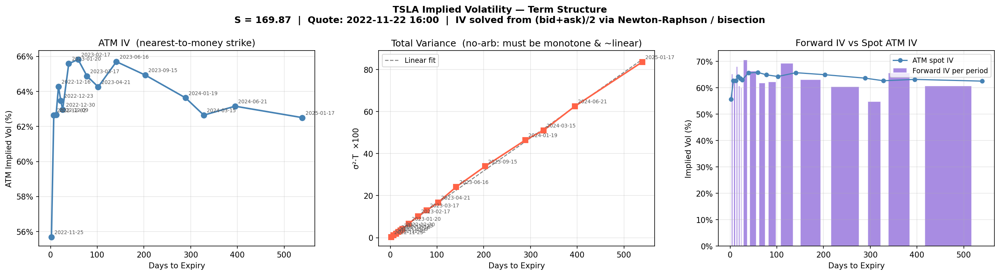
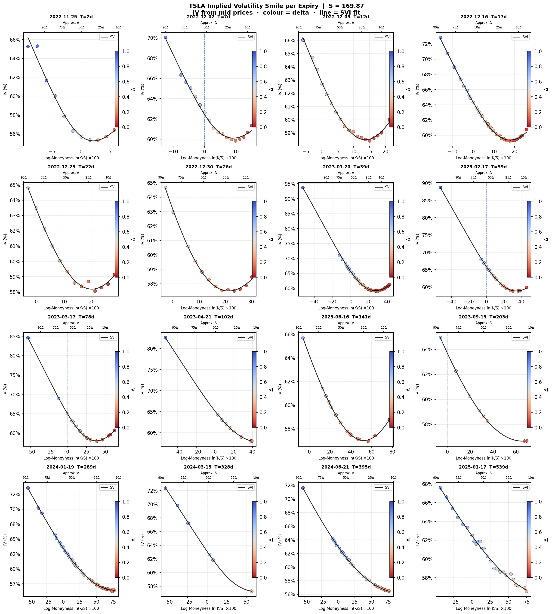
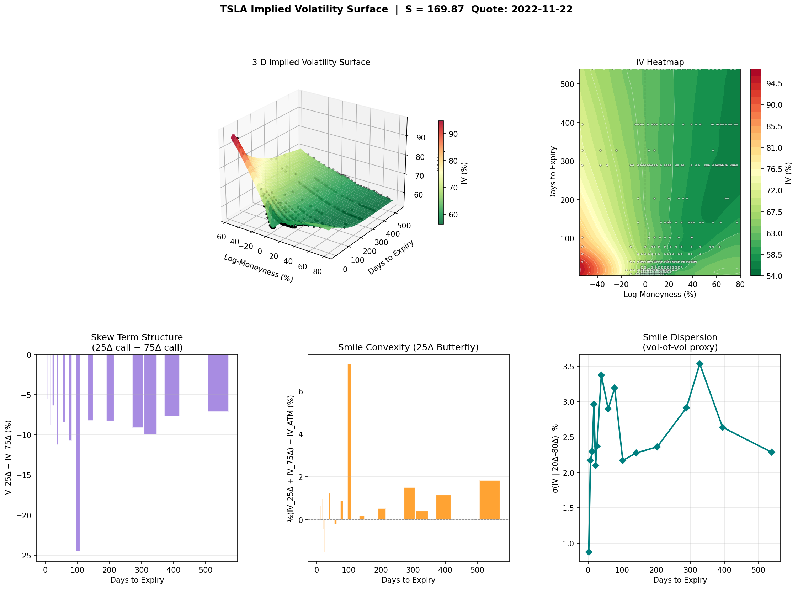
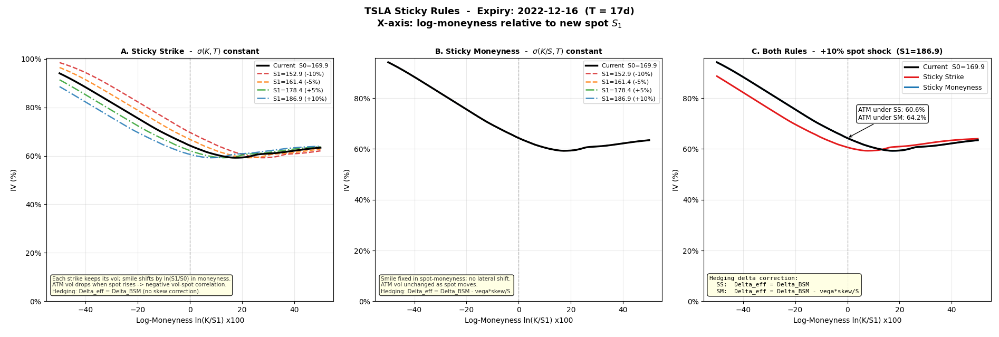

# Implied Volatility Surface (TSLA)

Building an implied-volatility surface from raw TSLA option quotes,
and using it to study smile dynamics and the delta corrections a desk needs
when spot moves.
---

## Scope and a key modelling assumption

The dataset is **TSLA call options only**, and TSLA pays no regular dividend.
By Merton (1973), early exercise of a call on a non-dividend-paying stock is
never optimal, so the American call equals the European call and Black-Scholes
is exact for both pricing and IV inversion. The IV solver therefore uses BSM
directly.

This argument does **not** extend to American puts (early exercise can be
optimal for deep-ITM puts), which would need a dedicated American-put pricer.
Restricting to non-dividend calls keeps the surface clean and theoretically
exact — a deliberate scope choice, stated explicitly.

All time-to-expiry uses the dual-time framework: T_trade (trading seconds)
drives the diffusion term, T_cal (calendar) drives carry and discounting.

---

## Pipeline

1. **Solve IV from mid prices.** For each option, invert the BSM price at
   mid = (bid+ask)/2 to an implied vol. The solver starts with the
   Brenner-Subrahmanyam ATM approximation, runs Newton-Raphson on vega, and
   falls back to bisection when vega is too small to trust (deep OTM). Prices
   violating no-arbitrage bounds return NaN.

2. **Clean the data.** Drop low-price, low-volume, wide-spread quotes; restrict
   log-moneyness and the BSM delta to [5%, 95%] (removing unreliable deep
   OTM/ITM wings); drop failed or extreme IV solves. This leaves a
   high-fidelity set for surface fitting.

3. **Interpolate the surface (RBF).** Fit a thin-plate-spline radial-basis
   interpolator over ($\text{log-moneyness}$, $\sqrt{T}$ ). The $\sqrt{T}$ axis is used because skew
   scales as $1 / \sqrt{T}$ and total variance as T, which linearises the surface and
   stabilises interpolation and extrapolation.

SVI (below) is fitted separately per expiry for the smile plots; the
**surface itself is the RBF**, which every later query and the
sticky-rule analysis use.

---

## 1. Term Structure

Three views of the volatility term structure:

- **ATM IV** rises sharply from the 2-day expiry (~56%) and stabilises around
  63–66% — the short end is depressed (little time, low event risk priced) and
  the curve flattens at longer tenors.
- **Total variance $\sigma^2 T$** is plotted against a linear fit. A no-arbitrage
  surface must have total variance **monotone increasing** in T (otherwise
  calendar arbitrage exists). The near-linear, monotone fit confirms the
  surface is calendar-arbitrage-free.
- **Forward IV** (the vol of each forward period between expiries) extracted
  from successive total variances. Lower in forward ATM IV indicate periods that the 
  market expects to be relatively calmer, even if the overall spot-to-maturity ATM IV remains elevated.

---

## 2. Smiles per Expiry (with SVI)

Each panel is one expiry: IV scatter coloured by delta, with the SVI fit
overlaid. The top axis marks approximate delta levels (10$\Delta$..90$\Delta$).

### What SVI is

SVI (Stochastic-Volatility-Inspired, Gatheral 2004) is a five-parameter form
for **one expiry's** smile. It parameterises **total variance** $w = \sigma^2 T$, not
volatility directly:

    
  $w(x) = a + b[ \rho (x − m) + \sqrt{((x − m)^2 + \sigma^2)} ],   x = ln(K/F)$

The five parameters have clean geometric meanings:

| Parameter    | Controls                                          |
|--------------|---------------------------------------------------|
| **$a$**      | overall level (raises/lowers the whole slice)     |
| **$b$**      | wing slope (how steeply both wings rise)          |
| **$\rho$**   | direction of the skew                             |
| **$m$**      | horizontal position of the smile's minimum        |
| **$\sigma$** | curvature of the trough (larger = rounder bottom) |

### Why SVI rather than a polynomial

SVI has no-arbitrage structure built in. By Lee's moment formula, total
variance can grow **at most linearly** in the far wings; SVI's wings are linear
by construction, so it extrapolates sensibly, whereas a polynomial grows
quadratically and misbehaves. The fit also enforces $a + b·\sigma·\sqrt{(1−\rho^2)} ≥ 0$, which
keeps total variance non-negative (no butterfly arbitrage). The fit minimises
squared error in variance space from three starting points (SVI is non-convex)
with these constraints as penalties.

### What the smiles show

The short expiries show a pronounced, convex smile (steep put-side skew, the
classic equity shape). As maturity lengthens the smile turns to skews and the
minimum drifts to higher moneyness — visible as the SVI trough moving right.
The fit tracks the data tightly across all tenors, confirming the IV solver and
the smile shape are well-behaved.

---

## 3. Surface and Diagnostics

### 3-D Surface & Heatmap

The 3-D surface and its heatmap show the RBF interpolant over
(log-moneyness, days to expiry). Several features are worth reading off it:

- **The deep-red corner — short-dated, low-strike — dominates.** IV rises
  steeply for low strikes (negative log-moneyness, K < S) at short maturity,
  reaching into the 90s while the rest of the surface sits in the 55–70 range.
  This is the equity skew in its sharpest form: near-term downside protection
  is the most expensive thing on the board. It is also where the surface is
  most curved, and where any interpolation is least reliable (fewest, most
  scattered quotes — visible as the sparse points in that corner of the
  heatmap).

- **Skew flattens into the wings and with maturity.** Moving right (toward
  high strikes / positive log-moneyness) the surface cools to the green
  55–60 range, and the steep short-dated smile relaxes into a gentler tilt skew at
  longer tenors — the long end is a mild, almost linear slope rather than a
  sharp corner.

- **The term structure is mild away from the corner.** Along any fixed
  moneyness, IV varies only modestly with maturity (the green region is fairly
  flat front-to-back), consistent with the near-linear total-variance term
  structure seen earlier — most of the surface's structure lives in the
  moneyness direction, not the maturity direction.

- **Data coverage is uneven.** The overlaid quote points (heatmap) cluster
  near ATM and thin out in the deep wings and at the longest tenors, so the
  surface is genuinely data-driven near the money and increasingly an
  extrapolation toward the edges — a caveat for any pricing read off the
  far corners.

All three lower-panel diagnostics use **call delta** to locate strikes: $75\Delta$ is
a low strike (ITM call, downside), $50\Delta$ is ATM, $25\Delta$ is a high strike (OTM call,
upside). There are always two points to keep in mind:

1. The points are the **nearest available quotes** to 0.2 / 0.25 / 0.50 / 0.75 / 0.8
  delta, not interpolated to exact delta. On sparse expiries (especially the
  shortest tenors, which have few strikes) these anchors are approximate, so
  the metrics there are noisy.

2. The metrics assume the smile is anchored at ATM (50Δ). In this data the smile
  minimum often sits well to the right of 50Δ (at lower delta / higher strike),
  and the longest tenors are nearly monotone with no clear bottom — so
  ATM-referenced metrics can misrepresent the true smile shape.

  
- **Skew term structure** ($25\Delta − 75\Delta$):the high-strike IV minus the
  low-strike IV. It is **negative at every tenor**, confirming the equity put
  skew — low strikes carry higher IV as the market pays up for downside
  protection. The magnitude varies non-monotonically across tenors rather than
  decaying cleanly with maturity; the single very large value near 100 days is
  a sparse/noisy expiry (it also shows up as an outlier in the convexity panel).

- **Smile convexity** ($25\Delta$ butterfly): the average
  of the two wings minus the ATM IV — a measure of curvature **relative to ATM**.
  It is positive when the wings sit above ATM. Crucially, because the actual
  smile minimum is often not at 50Δ but further toward the upside, this
  ATM-referenced butterfly understates the true convexity, and the occasional
  negative value reflects the trough sitting away from 50Δ (so $\text{IV}_{25\Delta}$ falls
  near or below $\text{IV}_{50\Delta}$) rather than a genuinely inverted smile. A butterfly
  centred on the actual minimum would be a cleaner convexity measure.

- **Smile dispersion** (vol-of-vol proxy): how widely IV varies across
  strikes within one expiry — low for a flat smile, high for a steep or convex
  one. Labelled a **vol-of-vol proxy** because smile convexity is driven by the
  volatility of volatility; a wider IV spread loosely indicates more uncertainty
  priced into vol itself. It is only a proxy, not a vol-of-vol calibrated from a
  stochastic-volatility model, and it too is sensitive to how many clean points
  fall in the $20\Delta–800\Delta$ band at each tenor.

---

## 4. Sticky Rules — the desk-relevant part

When spot moves from S0 to S1, how does the smile move with it? There is no
single answer — it depends on the **sticky convention** the market follows, and
the choice changes the **hedging delta**. 

### Where the delta corrections come from

When the smile moves with spot, the IV of a fixed strike is itself a function
of spot, so the true hedging delta is the total derivative:

 $\Delta_{eff} = \frac{dV}{dS} = \underbrace{\frac{\partial V}{\partial S}}_{\Delta_{BSM}} + \underbrace{\frac{\partial V}{\partial \sigma}}_{vega} \cdot \frac{d\sigma}{dS}$

The correction is essentially a vanna term $(vega × d\sigma/dS)$: choosing the wrong
sticky rule means hedging with the wrong vanna adjustment.

Each sticky rule has a different answer for $d\sigma/dS$:

- **Sticky Strike (SS):** $\sigma(K, T)$ fixed — each strike keeps its vol. In
  moneyness space the smile shifts left by ln(S1/S0) when spot rises. ATM vol
  then falls as spot rises (negative vol-spot correlation). Hedging delta needs
  **no correction**: $\Delta_{eff} = \Delta_{BSM}$.

- **Sticky Moneyness (SM):** $\sigma(ln(K/S), T)$ stays fixed — the smile shape is
  pinned to moneyness and does not shift laterally. ATM vol is changed as
  spot moves. The hedging delta gains a correction:
  $\Delta_{eff} = \Delta_{BSM} - vega·skew·1/S$, Where $skew = \partial{\sigma}/\partial(ln(S/K))$.
  For equities' negative skew this correction is positive.

### Why Sticky Delta is not shown separately

A third convention, Sticky Delta ($\sigma(\Delta,T)$ fixed), is often listed alongside
these. But with the smile parameterised in spot-moneyness, it adds nothing
here: fixing delta means fixing $d_1$, and since
$d_1 = [−ln(K/S) + (b + 1/2 \sigma^2)T] / (\sigma\sqrt{T})$, holding $d_1$ and $\sigma$ fixed holds $ln(K/S)$ fixed
— which is exactly Sticky Moneyness. Sticky Delta only differs from Sticky
Moneyness when the two use different moneyness bases (e.g. forward- vs
spot-moneyness); under a single spot-moneyness parameterisation they coincide,
so only the two genuinely distinct rules are shown.

### Why it matters

Panel C overlays both rules for a +10% spot shock. The ATM vol the desk marks
differs by rule — e.g. 60.6% under Sticky Strike versus 64.2% under Sticky
Moneyness — and that feeds straight into the delta hedge. Assuming sticky-strike
while the market is really sticky-moneyness means hedging with the wrong delta
(off by vega·skew/S) and being systematically under- or over-hedged after spot
moves. The sticky convention is a real risk decision, not a modelling detail.

---

## Limitations

- Calls only, non-dividend underlier — exact by Merton, but the method does not
  extend to American puts without a dedicated pricer.
- The RBF surface is a smooth interpolant, not an arbitrage-free model: it does
  not strictly guarantee the absence of butterfly or calendar arbitrage
  everywhere (the diagnostics check for it rather than enforce it). A fully
  arbitrage-free surface would use an SVI/SSVI calibration across all slices
  with the no-arb constraints imposed jointly.
- SVI is used for per-slice visualisation, not stitched into the surface.

